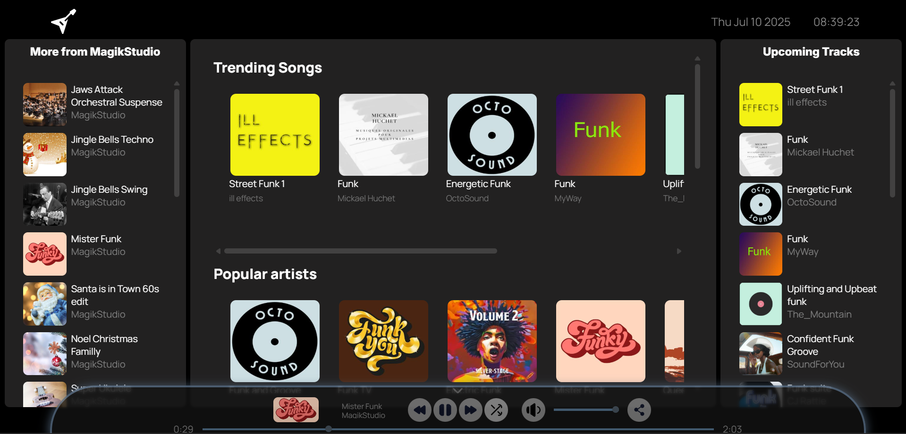

# 🎵 Dummy Music Streaming Platform

A project loosely inspired by Spotify, built purely with HTML, CSS, and JavaScript.

This is a conceptual clone with a custom UI and layout, created for learning and experimentation.

## 📸 Preview

## 🎯 What This Website Actually Does

I built this with the thing in mind that while people code, there's a need for white music that keeps on playing in the background. This music streaming platform provides a continuous flow of royalty-free tracks perfect for coding sessions, studying, or just vibing while you work.

**Fun Fact:** This website is intentionally not responsive – because who codes on a phone? (Pun intended! 😄) It's designed for desktop (and laptop of course) developers who need their tunes while they craft beautiful code on proper screens.

# 🛠️ Tech Stack

HTML5 for structure

CSS3 for styling and layout

Vanilla JavaScript for interactivity and functionality

# 📁 Assets & Credits

Songs & Images: Any kind of media used is from https://developer.jamendo.com/v3.0.

Icons: SVG icons are used from https://www.svgrepo.com/.

Autoplay icons created by yaicon - Flaticon

# 🎨 Creative Liberty

This project is a creative interpretation and not an exact replica of Spotify.

UI/UX decisions, layout styling, and features were made with flexibility and originality in mind.

This project is non-commercial and uses the Jamendo API under its free tier. All music is royalty-free and intended for educational purposes only.
